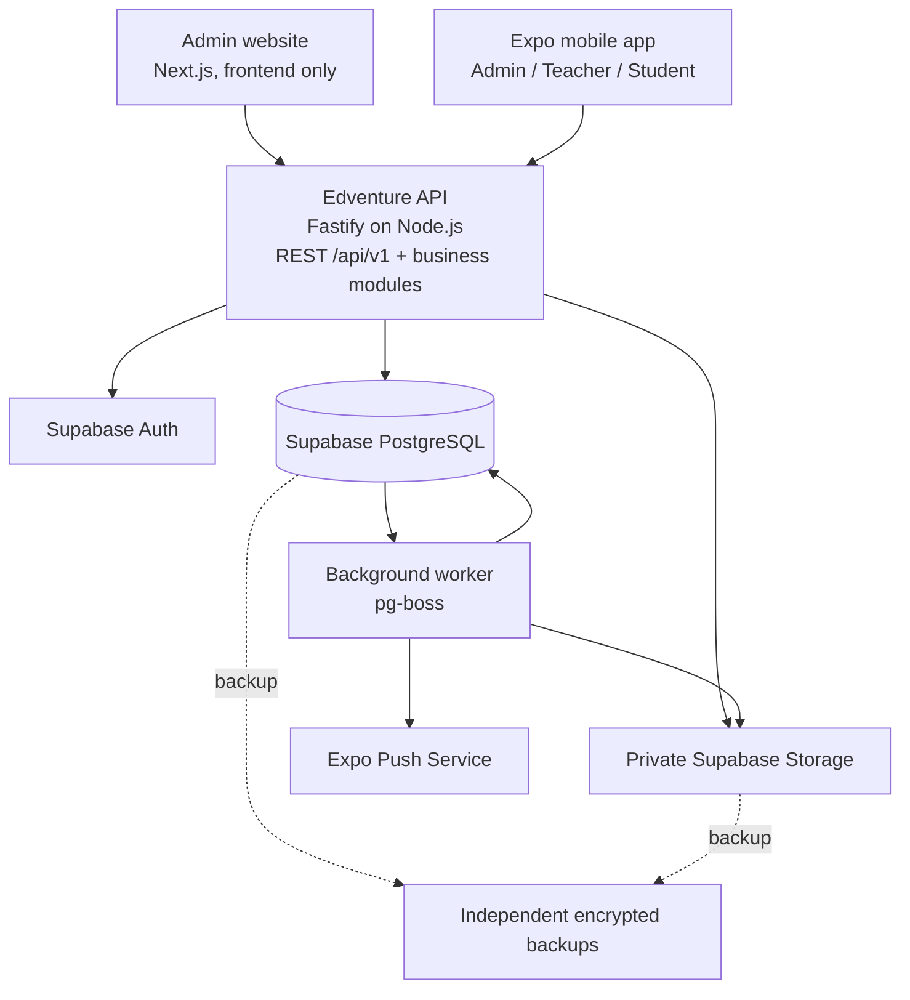
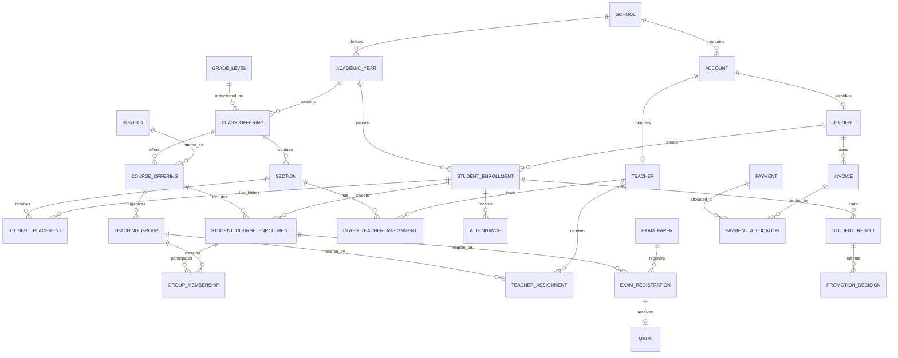

# Edventure — Detailed Product and Development Plan

## 1. Product direction and release scope

Build a reusable school management platform, beginning with one production school in Pakistan. The architecture will support additional schools without restructuring the database or rewriting the applications.

The original prompt establishes the business needs. The revised prompt expands the requirements around architecture, security, academic history, and maintainability. This plan reconciles both documents with your confirmed choices.

### Confirmed decisions

| Area | Decision |
|---|---|
| Initial deployment | One-school production pilot, with multi-school isolation built from the beginning |
| First release | All listed feature families, delivered through internal milestones before production launch |
| Languages | English and Urdu at launch, including right-to-left layouts |
| Applications | Admin website and one Android/iOS application with separate admin, teacher, and student experiences |
| Admin mobile | Daily operations; complex configuration, imports, and timetable editing remain on the website |
| Student attendance | One daily roll call per student |
| Class teacher | Explicitly assigned by an administrator |
| Login | School code, username, and password |
| Offline behavior | Previously loaded information and attendance drafts; submission requires reconnection and review |
| Delivery team | Three developers, one QA engineer, and part-time product/design support |

“One mobile application” is a packaging default: users see only the experience appropriate to their school account and roles. Separate school-branded app-store listings are a later commercial option.

### First-release functionality

The production pilot includes:

- School configuration, academic years, calendars, classes, sections, subjects, and academic streams.
- Student, teacher, and administrator accounts and profiles.
- Teacher assignments, class teachers, and manually maintained timetables.
- Student and teacher attendance, statistics, and reports.
- Student and teacher leave requests and approval.
- Homework, attachments, submissions, feedback, and completion tracking.
- Basic quizzes with multiple-choice and short-answer questions.
- Exams, schedules, marks, grading, published results, and report cards.
- Promotion recommendations, administrator approval, and manual overrides.
- Fee charges, bank CSV reconciliation, partial payments, outstanding balances, and reminders.
- Administrative fines, adjustments, waivers, and payment reversals.
- Files, announcements, push notifications, and an in-app notification center.
- CSV imports, downloadable templates, filtered exports, and PDF reports.
- Search, dashboards, audit trails, account suspension, and 30-day recovery.
- Confidential salary records accessible to administrators.
- English and Urdu interfaces across the supported applications.

### Requirements reconciled between the prompts

| Requirement | Planned behavior |
|---|---|
| First-period teacher automatically becomes class teacher | Replaced by your confirmed choice: administrators assign class teachers explicitly. The timetable may provide a suggestion. |
| Automatic student promotion | Automatically calculate recommendations; administrator approval creates next-year enrollments. |
| Delete all data after 30 days | End account recovery after 30 days; purge or anonymize records according to their retention category. Preserve required academic and financial relationships. |
| Redis/Upstash requested originally | Omit initially. Add shared caching only if measured performance justifies it. |
| Fines mentioned only in the original | Include administrator-issued fines through the fee system. |
| Salary information | Store compensation separately from ordinary teacher profiles, with administrator-only access. |
| “Class cannot have two subjects simultaneously” | Allow simultaneous lessons for disjoint Biology/Computer Science groups; prevent conflicts for actual students, teachers, and rooms. |
| Student suspension | Separate disciplinary suspension, account access, and academic enrollment. |

Later releases may add guardian accounts, payroll processing, direct bank integrations, automatic timetable generation, period attendance, advanced assessment tools, and fully offline submissions.

---

## 2. Architecture, technology, and security

### System architecture

Use a **modular monolith**: one backend codebase with clear business modules, plus a separate worker process for background jobs.

**One backend for every frontend.** The same API (`apps/api`, `/api/v1`) serves the admin website and the Android/iOS app's admin, teacher and student experiences. Frontends are separate apps (`apps/web`, `apps/mobile`) that contain no business rules and never touch the database; they share typed contracts (`packages/contracts`) and a typed client (`packages/api-client`) with separate web (cookie) and mobile (token) transports. A feature is implemented once in the backend and exposed to every frontend. The website proxies `/api` to the backend so its HttpOnly session cookies stay same-origin.

All business operations pass through the backend. The mobile application does not directly edit database tables.

Organize backend modules around:

- Identity and permissions.
- People and employment.
- Academic structure and enrollment.
- Timetables and teaching assignments.
- Attendance and leave.
- Homework and quizzes.
- Exams, results, and progression.
- Fees and reconciliation.
- Files, communications, and reporting.
- Audit, recovery, and platform operations.

Each module owns its business rules and database operations. Route handlers remain thin, and the worker reuses the same business services.

### Technology choices

| Technology | Purpose and tradeoff |
|---|---|
| TypeScript | Shared types across backend, website, and mobile. Reduces interface mismatches but does not replace runtime validation. |
| Node.js, Fastify and Next.js | One standalone Fastify API serves every client (website and all mobile experiences), with Zod-validated routes and generated OpenAPI. Next.js hosts only the admin website UI and proxies `/api` to the API, so there is exactly one backend to operate. |
| React Native, Expo, Expo Router | One Android/iOS codebase with native navigation, notifications, uploads, and device storage. |
| Supabase PostgreSQL | Relational storage, transactions, constraints, and tenant isolation for interdependent school records. |
| Supabase Auth | Managed password authentication and sessions. A server-side adapter translates school usernames into authentication identities. |
| Supabase Storage | Private object storage for documents and attachments. Removing it would require another object-storage provider. |
| Drizzle and SQL migrations | Typed database queries with explicit SQL for constraints, indexes, triggers, and security policies. SQL migrations remain the schema source of truth. |
| Zod and shared contracts | Validate requests, forms, import rows, and API responses at system boundaries. |
| TanStack Query | Request deduplication, client caching, retries, and invalidation. Avoid a separate global state library initially. |
| Tailwind CSS and shadcn/ui | Accessible web components and consistent styling. Mobile uses native components with shared design tokens. |
| i18next | Shared English/Urdu translation keys and formatting conventions. |
| pg-boss | PostgreSQL-backed jobs for imports, notifications, exports, scheduled reminders, and cleanup. Supports enqueueing within existing transactions. [Project documentation](https://github.com/timgit/pg-boss) |
| Expo SecureStore and encrypted SQLite | Secure tokens and narrowly scoped offline data. Expo SQLite supports SQLCipher configuration for encrypted databases. [Documentation](https://docs.expo.dev/versions/latest/sdk/sqlite/) |
| Playwright/Chromium | Web end-to-end testing and server-generated PDFs with tested Urdu shaping. |
| Vitest and Maestro | Business-rule tests and mobile acceptance flows. |
| Sentry and structured application logs | Error tracking and operational diagnostics, with personal-data redaction. |

Use one workspace containing the web/API application, mobile application, worker, shared contracts, translations, and design tokens. Share business contracts and visual foundations; keep web and native UI implementations appropriate to their platforms.

Pin supported stable dependency versions during setup. Do not adopt beta features for core workflows.

**Deliberately omitted initially:** Firebase, microservices, GraphQL, Kubernetes, Elasticsearch, Redis, a separate message broker, and a custom authentication/password implementation.

### Multi-school isolation

Use a **shared PostgreSQL database and shared schema with `school_id` on tenant-owned records**.

This offers the simplest operational model for a small team. Separate databases per school would multiply migrations, backups, monitoring, and support work before the business needs that isolation level.

Enforce isolation through:

1. Verified account-to-school membership.
2. Backend permission and assignment checks.
3. PostgreSQL row-level security.
4. Composite foreign keys that include `school_id`.
5. Tenant-scoped file authorization, jobs, caches, and exports.

Routine SQL connections must use a non-owner role without `BYPASSRLS`. Set verified school and actor context inside each transaction; missing context denies access. Connection pooling must never retain another request’s tenant context.

Keep application tables in a private schema and explicitly revoke direct client access. Supabase distinguishes table grants from RLS, and privileged service credentials can bypass row policies. [RLS documentation](https://supabase.com/docs/guides/database/postgres/row-level-security)

Platform administrators use separate privileged identities. They can provision schools and manage platform operations; ordinary platform access does not automatically expose school records. Any support access must be time-limited and audited.

### Authentication and account lifecycle

**Login flow**

1. User enters school code, username, and password.
2. Backend resolves the school-scoped account.
3. Backend authenticates through Supabase Auth.
4. Backend checks account status and password-change requirements.
5. Backend registers the application session and returns the appropriate role experience.

Use school-scoped authentication identities initially. A password reset by one school must not affect an account at another school.

Because Supabase password accounts use email or phone identities, provision an immutable, opaque internal email identifier under a controlled domain. It is an authentication identifier only: students do not need an inbox, and recovery does not depend on mail sent to it. Usernames and contact information remain separate.

Account creation must happen server-side. Supabase provides an administrative account-creation API for this purpose. [Documentation](https://supabase.com/docs/reference/javascript/auth-admin-createuser)

**Credential rules**

- Disable public registration.
- Administrators set or generate temporary passwords.
- Require password replacement on first use and after an administrator reset.
- Never allow administrators to retrieve existing passwords.
- Display a temporary password only during the immediate provisioning/reset flow.
- Bulk imports create profiles and provisioning states; distribute credentials through a controlled activation/reset workflow rather than permanent plaintext exports.
- Require MFA for school and platform administrators.
- Provide platform-assisted recovery for a school’s last administrator.

**Sessions**

- Website: Secure, HttpOnly cookies, server-managed refresh, origin validation, and CSRF protection.
- Mobile: tokens in SecureStore; serialize refresh attempts to avoid rotation races.
- Track application sessions against the authentication session identifier.
- Check active account and session status on every protected request.
- Password reset, suspension, deletion, and explicit revocation invalidate application sessions immediately.

A signed access token can remain valid after logout until expiry; the application session check closes that access gap. [Supabase session documentation](https://supabase.com/docs/guides/auth/sessions)

**Separate statuses**

- Account: pending, active, suspended, disabled, pending deletion.
- Student enrollment: active, withdrawn, transferred, completed.
- Employment: active, on leave, ended.
- Disciplinary suspension: effective dates and reason, independently managed.

Disciplinary suspension alone preserves access to schoolwork. An administrator can separately suspend app access. Neither action silently removes enrollment or cancels fees.

### Permission matrix

“Assigned” means an active teaching assignment, class-teacher assignment, or explicit delegation. Historical assignments do not preserve current access.

| Capability | School admin | Class teacher | Teacher | Student |
|---|---|---|---|---|
| School settings, years, classes, subjects | Manage | View relevant | View relevant | View relevant |
| Create users and reset passwords | Manage | — | — | — |
| Change roles and account status | Manage | — | — | — |
| Student profile and enrollment | Manage | Relevant section information | Minimal assigned roster | Own |
| Guardian contact information | Manage | Relevant section contacts | — | Own profile view |
| Teacher employment and salary | Manage | — | — | — |
| Teacher’s ordinary profile | Manage | Own | Own | Limited teacher identity |
| Class-teacher assignments | Manage | View own | View own | View relevant |
| Timetable configuration | Manage | View | View | View own |
| Student daily attendance | Manage | Assigned section | Explicit delegated roll call | Own view |
| Student attendance statistics | All | Assigned section | Authorized scope | Own |
| Teacher attendance | Manage | Own view | Own view | — |
| Leave requests | Approve/manage | Submit own | Submit own | Submit own |
| Homework and materials | Oversee/manage | Section overview; edit assigned teaching | Assigned teaching | View/submit own |
| Quizzes | Oversee/manage | Assigned teaching | Assigned teaching | Attempt own |
| Exam scheduling and date sheets | Manage | View | View | View relevant |
| Marks | Review/correct | Assigned teaching | Assigned teaching | Published own |
| Publish results | Manage | — | — | — |
| Promotion and transfers | Manage | View relevant decisions | — | Own outcome |
| Fees, fines, and reconciliation | Manage | — | — | Own statement |
| Announcements | Broadcast | Course/class notices within scope | Assigned-course notices | Receive |
| Imports and bulk exports | Manage | — | — | — |
| Reports | All authorized reports | Section academic/attendance | Assigned-course reports | Own report cards |
| Audit, deletion, and restoration | Manage | — | — | — |

A class teacher remains a teacher with additional section-scoped permissions. This is an assignment, not a permanent global role.

---

## 3. Data model and business behavior

### Database conventions

- UUID primary keys.
- `school_id` on every tenant-owned record.
- UTC timestamps; school-local dates for attendance, calendars, and due dates.
- Pakistan defaults: `Asia/Karachi`, PKR, Gregorian academic dates.
- Exact decimal money and marks; never floating-point financial calculations.
- Version fields for concurrently editable records.
- Effective-date ranges use `[start, end)` semantics.
- Published documents and results retain immutable revisions.
- Referenced academic and financial records use restrictive deletion rules.

### Logical schema

The following defines the table boundaries and essential relationships. Common identifiers, timestamps, tenant fields, and revision fields are omitted for readability.

| Domain | Tables and essential information |
|---|---|
| School configuration | `schools`: code, names, timezone, currency, branding, status. `school_policies`: attendance, retention, notification, and operational settings. |
| Accounts | `accounts`: auth identity, username, status, locale, password-change flag, provisioning state. `account_roles`: school-admin/teacher/student assignments. `app_sessions`: auth session ID, account, device, expiry, revocation. |
| People | `students`: account, admission number, names, contact details, optional DOB/address. `teachers`: account, employee number, names, contact and qualification fields. |
| Family contacts | `guardians`; `student_guardians`: relationship, primary/emergency flags. These are contact records, without guardian login accounts initially. |
| Employment | `employment_records`: teacher, dates, status, job title. `compensation_records`: effective dates, salary amount, currency, administrator-only notes. |
| Academic calendar | `academic_years`; `terms`; `school_calendar_days`: instructional dates, holidays, closures. |
| Class structure | `grade_levels`: configurable labels and progression target. `class_offerings`: grade level in an academic year. `sections`: class offering, code, capacity. |
| Enrollment history | `student_enrollments`: student, academic year, status. `student_placements`: enrollment, section, effective dates, movement reason. |
| Curriculum | `subjects`; `curriculum_versions`; `curriculum_subjects`: compulsory/elective status, stream association, weight, optional credit. `streams`: configurable academic pathways. |
| Actual subject participation | `course_offerings`: subject in a year/class offering. `student_course_enrollments`: enrollment, course, dates, status. `student_stream_assignments`: enrollment, stream, effective dates. |
| Teaching groups | `teaching_groups`: course offering and group label. `teaching_group_memberships`: student course enrollment and effective dates. |
| Teaching assignments | `teacher_assignments`: teacher, group, effective dates. `class_teacher_assignments`: teacher, section, effective dates. `attendance_delegations`: substitute roll-call authority and dates. |
| Timetables | `rooms`; `period_definitions`; `timetable_versions`; `timetable_lessons`: day, time range, teaching group, teacher, optional room. `lesson_exceptions`: cancellation, substitution, or date-specific change. |
| Attendance | `student_attendance`: student, enrollment, placement, date, status, reason, recorder. `teacher_attendance`: teacher, date, status. `attendance_revisions`: corrections and reasons. |
| Leave and discipline | `leave_types`; `leave_requests`: student/teacher, dates, reason, state, decision. `disciplinary_suspensions`: student, dates, reason, decision. |
| Homework | `homework`: course/group, content, due date, submission policy, state. `homework_recipients`: student audience snapshot and completion state. `homework_submissions`: recipient, revision, timestamp, feedback, score. |
| Quizzes | `quizzes`; `quiz_questions`; `quiz_options`; `quiz_assignments`; `quiz_attempts`; `quiz_answers`: versioned content, availability, attempt state, saved answers, and marking. |
| Exams | `exam_cycles`; `exam_papers`: subject, maximum marks, pass threshold. `exam_sittings`: date, time, optional room. `exam_registrations`: eligible students. `marks`: score or explicit outcome, version, recorder. |
| Grading and results | `grading_policy_versions`; `grade_bands`; `assessment_weights`; `result_publications`; `student_results`; `subject_results`: calculation inputs, policy version, published output, and revision. |
| Promotion | `promotion_batches`; `promotion_decisions`: source enrollment, result revision, recommendation, override reason, destination, approval, execution status. |
| Fees | `fee_types`; `fee_plans`; `fee_plan_items`; `student_fee_assignments`; `invoices`; `invoice_lines`: charge period, due date, amount, and academic year. |
| Payments | `bank_accounts`; `payments`; `payment_allocations`; `financial_adjustments`: source reference, receipt, allocations, credits, waivers, reversals, and refunds. |
| Imports | `import_batches`; `import_rows`; `bank_import_profiles`: file hash, mapping version, validation results, row status, duplicate evidence, and commit state. |
| Files | `files`: object key, uploader, size, MIME type, checksum, scan state, lifecycle. Dedicated attachment joins connect files to homework, submissions, profiles, announcements, and reports. |
| Communications | `announcements`; `announcement_audiences`; `notifications`; `notification_recipients`; `device_tokens`; `notification_deliveries`: recipient state, locale, delivery attempts, and read time. |
| Operations | `report_jobs`; `deletion_requests`; `retention_holds`; `audit_events`; `idempotency_records`. pg-boss maintains its separate queue schema. |

### Core academic ER diagram

Supporting tables are defined in the catalog above; this diagram shows the main relationships that preserve history.

### Constraints and indexes

Enforce these in PostgreSQL wherever practical:

- Unique school code and school-scoped usernames, admission numbers, and employee numbers.
- Composite tenant foreign keys, preventing cross-school relationships.
- One enrollment per student per academic year.
- No overlapping section placements for the same enrollment.
- One active class teacher per section.
- A teacher may lead multiple sections; do not impose an unrequested inverse restriction.
- One daily attendance record per student/date and teacher/date.
- One mark per exam registration.
- Scores between zero and the paper maximum, enforced transactionally and through database validation.
- Non-overlapping grade bands with complete configured coverage.
- Unique destination enrollment and execution identity for promotion.
- Unique bank transaction reference within a bank account when supplied.
- Payment allocations cannot exceed available payment or invoice balances.

Prioritize indexes for tenant/year/status lists, student/date history, section/date attendance, assignments, invoice balances, and transaction references. Add normalized-name search indexes for English and Urdu searches after testing actual query behavior.

### Profiles and admission

Required student information:

- Admission number.
- Display name.
- Username.
- Admission date.
- Academic-year enrollment and initial placement.

Required teacher information:

- Employee number.
- Display name.
- Username.
- Employment start date.

Contact details, alternate-language names, DOB, address, qualifications, and documents are optional schema fields. A school may require selected fields during onboarding. Do not require children to provide email addresses.

Creation flow:

**Enter profile → validate identifiers → assign academic context → create pending account → provision authentication → activate → issue temporary credentials.**

Authentication provisioning is a retryable state machine because external Auth operations cannot share the application database transaction. Failed provisioning remains visible and must not produce a falsely “active” account.

### Academic history, subjects, and timetables

- A section transfer closes the old placement and creates a new placement.
- Historical attendance, marks, and documents retain their original academic context.
- Streams supply subject-selection defaults; actual subject enrollment determines what a student studies.
- Changing a stream preserves previous subject history and previews timetable/exam consequences.
- Referenced sections and subjects are archived rather than deleted.
- Closed academic years are read-only except through an audited correction workflow.

Timetable workflow:

**Configure periods/calendar → create teaching groups → assign teachers → draft timetable → validate → publish effective version.**

Conflict detection checks teachers, rooms, and participating students. Biology and Computer Science may run simultaneously for disjoint groups in the same section.

Recheck conflicts when group memberships change, not only when a timetable is edited. Serialize concurrent schedule and membership changes so two requests cannot both approve a conflict.

Teacher absence uses an explicit substitution or cancellation. Teacher departure creates reassignment tasks and immediately ends access.

### Attendance and leave

Attendance statuses are fixed initially: **present, absent, late, excused**. Schools may configure reason codes without changing the reporting meaning of statuses.

- The class teacher or delegated substitute records daily roll call.
- Administrators maintain teacher attendance.
- A partially completed roll call remains a draft.
- Missing attendance is “not recorded,” never automatically absent.
- Teachers may correct their submission on the same school day; later corrections require an administrator and a reason.
- Reports distinguish attendance rate from recording completeness.

Default attendance rate:

**(Present + Late) ÷ (Present + Late + Absent)**

Excused days are excluded and reported separately. No recorded eligible days displays “No data.”

Leave flow:

**Student/teacher requests dates → administrator approves or rejects → notification → attendance review.**

Approved leave proposes excused attendance on instructional days. It does not overwrite an existing present/late record. Conflicts require review, and cancellations reverse only attendance entries created by that leave workflow.

### Homework and quizzes

Homework supports assignment to teaching groups, due dates, attachments, completion tracking, and optional submissions.

- Snapshot recipients when publishing.
- Newly joining students are added explicitly.
- Preserve submission revisions and timestamps.
- Permit late submissions with a visible late flag.
- Teachers provide feedback and optional marks.
- Class teachers see section-level completion summaries.

Quizzes include:

- Single-answer multiple-choice questions and manually marked short answers.
- Availability windows and optional time limits.
- One attempt by default; explicit retakes preserve earlier attempts.
- Server-authoritative start, deadline, and submission times.
- Incremental answer saving.
- Automatic MCQ marking and teacher marking for short answers.
- Explicit result release.
- Immutable question versions once attempts begin.

Quizzes require connectivity. Reconnection resumes the same attempt if its server deadline permits; it does not create a fresh timer.

### Exams, results, and promotion

Exam flow:

**Administrator creates cycle and papers → schedules sittings → registers eligible students → teachers enter marks → administrator reviews → results publish.**

Include printable date sheets and mark-entry sheets.

Grading rules support:

- Subject maximum and passing marks.
- Assessment weights.
- Grade boundaries.
- Overall pass requirements.
- Optional GPA through configured grade points and subject credits.

No production pass threshold is silently invented. Schools configure their grading policy before results can be published.

Marks distinguish numeric scores from absent, exempt, withheld, and missing outcomes. Missing/withheld marks block finalization. Exempt subjects are excluded according to the policy; absent outcomes follow the configured school rule.

Calculate with exact decimals and apply grade/pass thresholds before display rounding. Published results preserve their policy version and input snapshot.

Corrections require a reason and create a new publication revision.

Promotion flow:

**Select published final results → calculate recommendations → review incomplete/failed cases → select destination sections → record overrides → approve → create next-year enrollments.**

- Repeated execution cannot duplicate enrollments.
- Old enrollments remain intact.
- Terminal grades produce graduation.
- A school must configure the next grade explicitly.
- Promotion commits fail if the source results changed after review.

### Fees and bank reconciliation

Model charges and payments separately. Fee status is derived from the balance:

- Unpaid.
- Partially paid.
- Paid.
- Overdue as a separate flag.

Support recurring fee plans, student-specific assignments, manual charges/fines, waivers, credits, and audited reversals.

Bank import flow:

**Upload CSV → choose saved bank mapping → validate → detect duplicates → match references → review exceptions → approve receipts/allocations → update balances → generate reminders.**

Rules:

- Automatically match only exact, unique supported references.
- Never allocate solely from a student name.
- Reimporting the same file must not duplicate payments.
- Use bank transaction identifiers where available.
- Without a stable identifier, flag matching fingerprints for review; identical-looking payments may be legitimate.
- Preserve unmatched payments as unallocated receipts.
- Preserve overpayments as credit.
- Correct posted payments through linked reversals and replacements.
- Preview allocations before commit and return a per-row outcome afterward.

Initial bank support is a configurable CSV mapping system, with the pilot school’s actual format added as a tested mapping profile.

### Deletion and retention

Deletion flow:

**Delete → initial confirmation → second confirmation showing recovery deadline → disable access → recoverable state → retention processing after 30 days.**

- Reserve identifiers during the recovery window.
- Restore profiles only after checking enrollment and assignment conflicts.
- Never restore revoked sessions.
- Do not automatically restore a former class-teacher assignment that has been replaced.
- Preserve academic and financial references through retained or pseudonymized records.
- Files, exports, and backups follow their own lifecycle policies.
- Cleanup jobs are idempotent and audited.

Default policy: account recovery lasts exactly 30 days. Automatic academic/financial purging remains disabled until the school’s retention schedule is configured and approved by its responsible owner. These durations are operational configuration, not decisions left to an implementer.

### Important edge-case outcomes

| Situation | Required behavior |
|---|---|
| Student repeats a grade | New enrollment in the next academic year, retaining the same grade level |
| Student changes section or stream | Effective-dated change with an impact preview; preserve past records |
| Student transfers schools | Close origin enrollment; receiving school creates its own records |
| Teacher leaves midterm | Disable access and expose unassigned duties for reassignment |
| Two users edit attendance or marks | Reject stale versions with a conflict response |
| School changes grading rules | New policy version; existing publications remain unchanged |
| Exam is rescheduled | Preserve schedule history and notify affected recipients |
| Academic year closes with unresolved work | Show exceptions and block final closure until resolved |
| CSV contains duplicates or invalid references | Validation report; no hidden partial commit |
| Account is deleted with historical records | Retain stable references and apply category-specific retention |
| Attachment is removed | Show an explicit unavailable state; avoid broken silent links |
| Push delivery fails | Preserve the in-app notification and retry eligible deliveries |
| Offline attendance draft is stale | Require roster refresh and review before submission |

---

## 4. Applications, APIs, files, and notifications

### Navigation and dashboards

| Application | Navigation |
|---|---|
| Admin web | Dashboard; People; Academics; Attendance & Leave; Learning; Exams & Results; Fees; Communications; Reports; Settings & Audit |
| Admin mobile | Home; People; Approvals; Notifications; More |
| Teacher mobile | Today; Classes; Work; Notifications; Profile |
| Student mobile | Home; Learning; Timetable; Notifications; Profile |

Admin web routes use meaningful resource paths such as `/admin/students`, `/admin/students/:id`, `/admin/academics/timetables`, `/admin/exams`, `/admin/fees/imports`, and `/admin/reports`.

Use opaque identifiers in URLs. Authorization remains mandatory regardless of whether an identifier is guessable.

**Admin dashboard**

- Four headline metrics: enrollment, attendance, outstanding fees, pending approvals.
- A prioritized action list.
- Upcoming exams and recent announcements.

**Teacher dashboard**

- Today’s lessons.
- Pending roll call.
- Homework/quiz marking tasks.
- Relevant announcements.

**Student dashboard**

- Today’s timetable.
- Upcoming homework and assessments.
- Latest published result and relevant alerts.
- A compact link to attendance and fee details.

Dashboards summarize work and link to detailed screens. Avoid displaying every module as a card.

Admin mobile supports individual profile changes, attendance, leave approvals, notices, fee lookups/reminders, and result review/publication. Bulk import, policy setup, timetable editing, and batch promotion execution use the website.

### Design system and Urdu support

- Shared typography scale, spacing tokens, colors, and interaction patterns.
- One main accent color; status colors always accompanied by text.
- Accessible labels, keyboard operation, focus states, and touch targets.
- Consistent loading, empty, error, retry, and success states.
- Mobile forms use short steps; desktop management uses searchable tables.

English and Urdu must cover navigation, forms, validation, notifications, and report templates.

Use logical start/end positioning, explicit direction handling, and a tested Urdu-capable font. Keep identifiers, phone numbers, and mixed numeric content readable inside RTL screens. Expo provides localization and RTL mechanisms, but application layouts still require device testing. [Localization documentation](https://docs.expo.dev/guides/localization/)

School-authored content supports English and Urdu variants. If only one exists, show that version rather than silently machine-translating it.

CSV templates retain stable English machine-readable headers and accept UTF-8 Urdu values. PDF acceptance tests must verify shaping, line wrapping, tables, and mixed-direction names.

### Offline behavior

Persist only the information required for the confirmed offline use:

- Previously loaded timetable and homework summaries.
- Minimal assigned-class rosters.
- Attendance drafts.

Bind every cache and draft to school, account, date, roster revision, and record version.

- Encrypt persistent local data.
- Display the last synchronization time.
- Clear local data on logout and account switching.
- Expire cached rosters/drafts after seven days.
- Exclude salary, fee reports, guardian details, and sensitive profile documents.
- On reconnection, refresh permissions and roster information before presenting submission review.
- Use an idempotency key for the final submission.
- Never silently submit or overwrite server attendance.

### API specification

Expose a versioned REST interface at `/api/v1`. Determine tenant context from the authenticated account; clients cannot select an arbitrary tenant through request bodies.

| API family | Main responsibilities |
|---|---|
| `/auth/*`, `/me`, `/sessions` | Login, refresh, MFA, password replacement, current account, device sessions, logout |
| `/platform/schools` | Platform-only school provisioning and status management |
| `/school`, `/academic-years`, `/terms`, `/calendar` | School configuration, year lifecycle, instructional calendar |
| `/students`, `/teachers`, `/accounts` | Profiles, account status, credential resets, deletion and restoration |
| `/enrollments`, `/placements`, `/subject-enrollments` | Admissions, section moves, stream changes, enrollment history |
| `/classes`, `/sections`, `/subjects`, `/curricula`, `/streams` | Academic structure and subject rules |
| `/teaching-groups`, `/teacher-assignments`, `/class-teacher-assignments` | Teaching audiences and scoped responsibility |
| `/timetables`, `/lesson-exceptions` | Drafting, validation, publication, substitutions |
| `/attendance/students`, `/attendance/teachers` | Daily submissions, corrections, roster and summary queries |
| `/leave-requests` | Request, approval, rejection, cancellation, history |
| `/homework`, `/submissions` | Homework lifecycle, recipient status, uploads and feedback |
| `/quizzes`, `/quiz-attempts` | Question authoring, availability, attempt saving/submission, result release |
| `/exams`, `/exam-papers`, `/marks`, `/results` | Scheduling, registration, mark entry, review, publication and corrections |
| `/promotion-batches` | Preview, overrides, approval, idempotent execution |
| `/fee-plans`, `/invoices`, `/payments`, `/bank-imports` | Charges, reconciliation, allocations, corrections and statements |
| `/files` | Upload authorization, completion, status, download authorization, lifecycle |
| `/announcements`, `/notifications`, `/devices` | Broadcasts, inbox, read status, device registration |
| `/imports`, `/exports`, `/reports` | Templates, validation previews, commits, background output |
| `/dashboards`, `/audit-events` | Role-specific summaries and authorized audit queries |

Explicit state transitions use endpoints such as:

- `POST /timetables/:id/publish`
- `POST /imports/:id/commit`
- `POST /results/:id/publish`
- `POST /promotion-batches/:id/approve`
- `POST /accounts/:id/restore`

Interface conventions:

- Cursor pagination; default 50 records, maximum 100.
- Server-side search, filtering, and allowlisted sorting.
- ISO dates/timestamps; decimal strings for money and exact scores.
- Version preconditions for concurrent edits.
- Idempotency keys for imports, payments, publication, promotion, and retried submissions.
- `202 Accepted` and a job identifier for long-running work.
- Structured errors containing `code`, `message`, `fieldErrors`, and `requestId`.
- `409 Conflict` for stale versions and conflicting business state.
- Shared validation contracts and generated OpenAPI documentation.

### Imports, exports, and reports

Student templates include admission number, display name, optional Urdu name, username, academic-year code, class code, section code, and optional stream/contact fields.

Teacher templates include employee number, display name, optional Urdu name, username, employment start date, and optional contact/qualification fields.

Initial import limits: **5,000 rows or 10 MB per file**.

Student/teacher import flow:

**Download template → upload → validate all rows → inspect errors/duplicates → confirm → commit profiles transactionally → track authentication provisioning.**

Reject invalid batches before committing profiles. Any later provisioning failures are visible, retryable account states.

Reports include attendance, leave, enrollment, homework completion, exam outcomes, class/subject performance, fee balances, and teacher operational summaries. Avoid presenting unvalidated teacher rankings as performance measures.

Generate exports in background jobs. Include filters, academic year, generation time, and policy/publication version where relevant. Escape spreadsheet formula prefixes in CSV exports. Generated downloads expire after 24 hours and require authorization when accessed.

### File handling

Use private storage with application-generated object paths.

Initial limits:

- Profile images: 2 MB.
- Documents and assignment attachments: 20 MB.
- PDF, JPEG, and PNG for ordinary learning uploads.
- CSV restricted to import workflows.

Upload flow:

**Authorize owner/context → create upload intent → upload to quarantine → verify size/type/checksum → malware scan → mark available → attach to permitted entity.**

Use ClamAV in the worker environment for scanning. Reject executable, HTML, SVG, archive, and macro-enabled uploads initially.

Authorize downloads through the associated business record. Use short-lived signed URLs for ordinary learning material; proxy sensitive reports and profile documents through an authenticated download endpoint. Supabase privileged storage access bypasses RLS, so signing requires explicit application authorization. [Storage access-control documentation](https://supabase.com/docs/guides/storage/security/access-control)

### Notifications and background processing

Business changes and related pg-boss jobs are committed in the same database transaction. This provides the durable outbox behavior without a second queue system.

The in-app notification is the durable record. Push delivery is best effort.

- Snapshot broadcast recipients.
- Store each recipient’s read/unread state.
- Localize notification templates.
- Keep marks, fee amounts, and other sensitive details out of lock-screen text.
- Resolve deep links through fresh authorization.
- Check push receipts, retry transient failures, and retire invalid device tokens. [Expo delivery documentation](https://docs.expo.dev/push-notifications/sending-notifications/)
- Deduplicate event notifications and reminders.
- Default fee reminders to administrator-previewed sends; optional scheduled reminders are configured per school.

Jobs include exports, account provisioning, file scans, notifications, fee generation, cleanup, and backups. Failed jobs enter a visible retry/dead-letter workflow.

### Caching

Do not introduce Redis for the pilot.

| Data | Initial caching |
|---|---|
| School configuration and subject catalogs | Client cache, 10-minute freshness |
| Timetables | Client cache, 5-minute freshness; refresh on app focus and publication changes |
| Dashboards | In-memory client cache, 30-second freshness |
| Attendance, marks, and fee mutations | Fresh database validation; invalidate related client queries after success |
| Permissions and account status | Checked for each protected request |
| Offline information | Explicit encrypted device cache with timestamps and expiry |

Cache keys include school, account/scope, academic year, locale, and filters as applicable. User-specific API responses are not stored in public/shared caches.

Reconsider Redis only after query/index improvements fail measured performance targets or several API instances need shared caching/rate limiting.

---

## 5. Delivery, testing, deployment, and acceptance

### Delivery sequence

For the confirmed team and full bilingual scope, use **approximately 30–36 weeks as an initial planning range**, to be revised after the first discovery milestone. This is a planning estimate, not a fixed delivery promise.

Each milestone delivers tested vertical workflows across the relevant API, web, and mobile surfaces.

| Milestone | Indicative timing | Completion gate |
|---|---|---|
| 1. Product and technical foundation | Weeks 1–3 | Approved workflow prototypes, permission matrix, schema, pilot configuration inventory, Urdu/RTL and authentication feasibility checks |
| 2. Platform foundation | Weeks 4–7 | Tenant isolation, accounts, sessions, administrator MFA, audit, files, jobs, CI, staging, application shells |
| 3. People and academics | Weeks 8–12 | Imports, profiles, enrollment history, subjects/streams, groups, assignments, timetable publication |
| 4. Daily school operations | Weeks 13–17 | Attendance, offline drafts, leave, homework/submissions, announcements, notifications, useful dashboards |
| 5. Assessment and progression | Weeks 18–23 | Quizzes, exams, marks, grading, report cards, corrections, promotion |
| 6. Finance and administration | Weeks 20–26, partly parallel | Fee plans, bank reconciliation, fines/adjustments, reporting, recovery and retention controls |
| 7. Integrated release preparation | Weeks 27–30 | Full bilingual acceptance, security/performance testing, restore drill, training, release candidates |
| 8. Pilot stabilization and contingency | Weeks 31–36 | Controlled rollout, fixes, operational handover, production acceptance |

Suggested ownership:

- Developer 1: backend, database, authorization, and financial/academic rules.
- Developer 2: admin web, configuration, reporting, and design system.
- Developer 3: mobile experiences, localization, offline drafts, and push.
- QA: acceptance scenarios, test data, regression automation, device coverage, and release evidence.
- Product/design: school workflow validation, bilingual usability, and prioritization.

No listed feature family is postponed beyond the pilot merely because it appears in a later internal milestone.

### Testing plan

**Business-rule tests**

- Academic placement intervals and subject eligibility.
- Attendance denominators, holidays, leave, and missing records.
- Quiz deadlines and marking.
- Grade boundaries, weights, exemptions, missing marks, and rounding.
- Promotion eligibility, overrides, and terminal grades.
- Fee allocation, overpayments, reversals, and duplicate transactions.
- Recovery deadlines and retention holds.

**Database and API integration tests**

- Cross-school reads, writes, joins, attachments, jobs, and exports.
- Direct Data API/RPC/Storage bypass attempts.
- Account suspension with an otherwise valid access token.
- Role and teaching-assignment changes.
- Concurrent attendance edits, mark entry, allocations, and promotions.
- Transaction rollback and safe retry after timeout.
- Timetable conflicts caused by elective-group membership changes.
- Authentication provisioning failures and recovery.

**Web and mobile acceptance tests**

- Login, password replacement, MFA, and device revocation.
- Student/teacher creation and validated imports.
- English and Urdu versions of each critical workflow.
- Daily attendance, offline draft persistence, reconnection, and stale-roster conflicts.
- Homework upload, submission, feedback, and late status.
- Quiz start, answer saving, expiry, and result release.
- Exam creation through report-card publication.
- Reviewed promotion.
- Bank import, exception matching, allocation, and replay.
- Deletion, restoration, and assignment conflicts.
- Notification deep links and unauthorized file requests.

**Accessibility and localization checks**

- Keyboard and screen-reader operation.
- Text scaling and small mobile screens.
- RTL layout, mixed-direction text, and Urdu input/search.
- Urdu CSV round trips and PDF rendering.
- Contrast, focus visibility, form errors, and non-color status indicators.

### Performance targets

Test with a representative school containing:

- 5,000 students.
- 300 staff accounts.
- Three academic years of history.
- Several million attendance rows.
- A second synthetic tenant for isolation tests.

Initial acceptance targets under the agreed load profile:

- Common list/detail APIs: p95 below 700 ms.
- Ordinary writes: p95 below 1 second.
- Dashboard response: p95 below 2 seconds.
- Responsive operation during simultaneous morning roll calls.
- Imports and reports do not block interactive requests.
- No unbounded queries, cross-tenant scans, or client-side filtering of entire datasets.

Measure these in staging; they are engineering targets, not claims of existing performance.

### Deployment and operations

Use separate development, staging, and production environments.

Initial hosting default:

- Paid Render web service for the Edventure API (the single backend).
- Paid Render web service for the Next.js admin website (UI only; proxies `/api`).
- Separate Render background worker (same API codebase, `worker` entry point).
- Paid Supabase project with PostgreSQL, Auth, Storage, and point-in-time recovery.
- Singapore deployment region for application and database.
- Expo EAS for mobile builds and staged distribution.

Both Render and Supabase list Singapore regions. This default assumes no requirement to host exclusively inside Pakistan. [Render regions](https://render.com/docs/regions), [Supabase regions](https://supabase.com/docs/guides/platform/regions)

CI must run type checking, linting, business tests, database migrations/tests, API contracts, and selected end-to-end flows before release.

Use backward-compatible database changes and additive API evolution because installed mobile clients may lag behind backend deployments. Maintain a minimum-supported-app-version mechanism and a rollback procedure.

Monitor:

- API latency and error rates.
- Database saturation and slow queries.
- Authentication/provisioning failures.
- Import and payment-reconciliation failures.
- Queue age and failed jobs.
- Notification delivery failures.
- File-scan failures and storage growth.
- Backup freshness.

### Backups and recovery

Database backups must be supplemented with independent file backups: Supabase database backups do not include stored file objects. [Backup documentation](https://supabase.com/docs/guides/platform/backups)

Use encrypted, versioned AWS S3 storage for independent backup copies only; Supabase Storage remains the application’s primary file store. [S3 versioning](https://docs.aws.amazon.com/AmazonS3/latest/userguide/Versioning.html)

Recovery targets:

- Database recovery point: no more than 15 minutes of loss.
- Files: no more than one hour of loss.
- Service restoration: within eight hours.

Validate these with a complete staging restore, including authentication, custom database roles, file references, and pending jobs. After a restore, replay deletion/revocation records before reopening access, and prevent accidental replay of already-delivered external actions.

### Production acceptance gates

The pilot is ready only when:

1. Every agreed feature family passes acceptance testing.
2. Critical workflows work in English and Urdu on web, Android, and iOS.
3. A second synthetic school cannot access pilot-school information.
4. The school has validated grading, attendance, fee, and retention configuration.
5. Bank imports reconcile against an approved sample statement.
6. Historical records survive transfers, policy changes, promotion, and account deletion.
7. Backups have been restored successfully.
8. Administrators and teachers complete training with realistic data.
9. Monitoring, support ownership, recovery procedures, and credential recovery are documented.
10. No unresolved critical security or data-integrity defect remains.

### Subsequent releases

**Phase 2 — Repeatable multi-school operations**

Add onboarding automation, school configuration templates, tenant quotas, subscription administration, support tooling, and improved operational analytics. Validate a second real school without school-specific code branches.

**Phase 3 — Advanced capabilities**

Consider guardian accounts, separately branded apps, direct bank/payment integrations, payroll, automated scheduling, period attendance, advanced quizzes, and offline submission synchronization.

The first implementation milestone should produce approved workflows, migration-ready schema specifications, API contracts, and tested authentication/Urdu prototypes before broad feature development begins.
