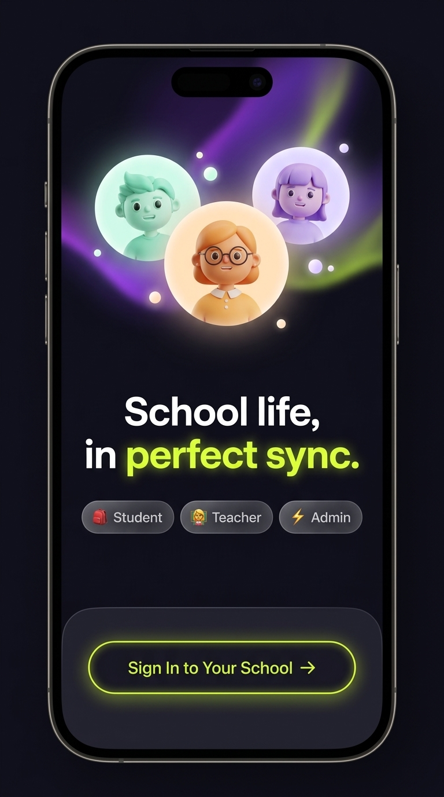
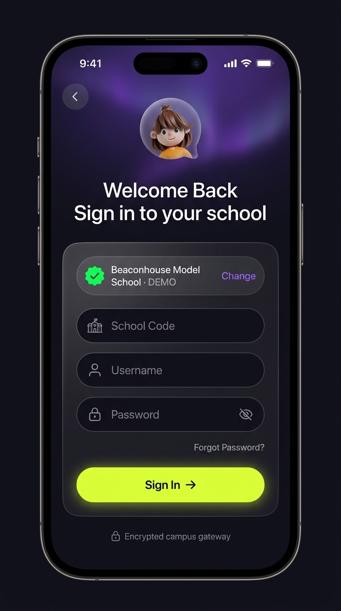
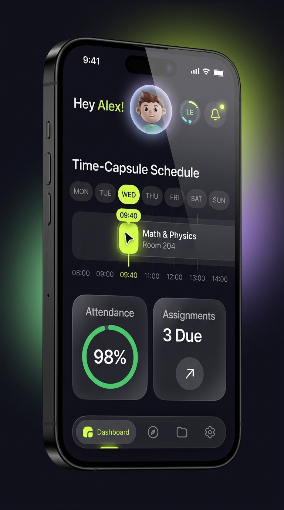
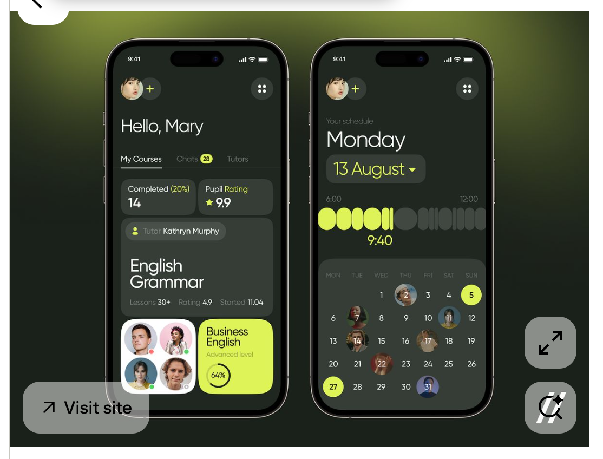
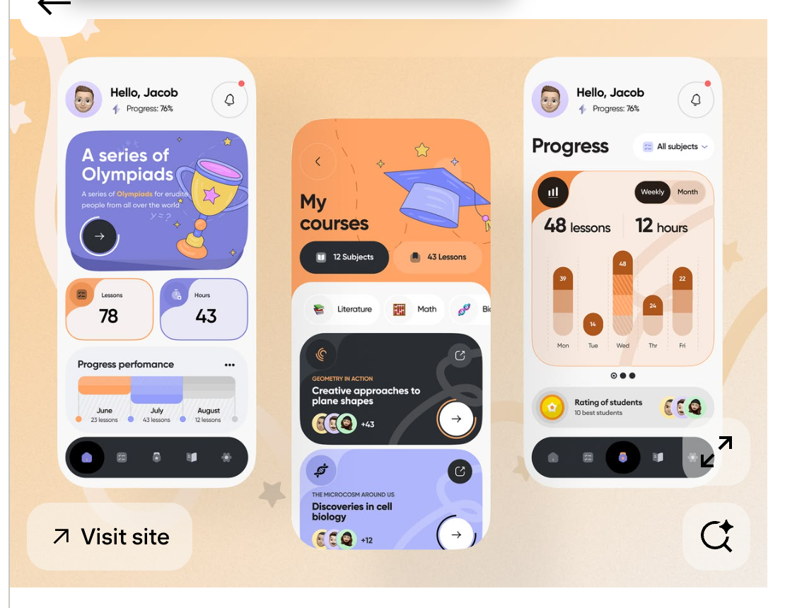
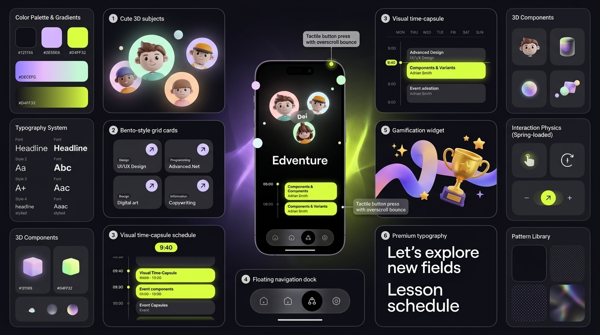

# Edventure — Complete Screen Showcase & Design System

> **Design Vision**: "Dark Obsidian Aurora & 3D Character Play" — Directly derived from the 5 reference inspirations provided by the user.

---

## 📱 Complete Screen Design Showcase (iPhone 16 Pro)

### 01 · Welcome & Onboarding
*Ambient purple & electric-lime aurora backdrop, 3D Pixar-style clay character avatars floating in pastel bubbles, bold glowing typography, frosted glass role pills, and a tactile glowing electric-lime button.*

---

### 02 · School Login
*Atmospheric dark obsidian canvas, 3D character bubble peek, elevated dark frosted glass container, verified school pill with green checkmark badge, sleek input fields with icons, and a glowing neon lime CTA button.*

---

### 03 · Student Home Dashboard
*3D character bubble avatar with level ring and notification ping, interactive horizontal time-capsule schedule bar with glowing `09:40` cursor pointing to the active class, frosted bento cards with attendance radial dial and assignments `↗` chip, and floating dark capsule dock.*

---

### 04 · Timetable & Class Schedule
*Dynamic timeline track (08:00 – 14:00) with days of week above, snapped glowing electric-lime cursor indicator, class cards with teacher badges, room tags, and live period highlights.*

---

### 05 · Gamification, Attendance & Course Hub
*3D golden trophy widget with sparkle particles, course cards with 3D graduation caps, tactile stat pills, and rounded action buttons.*

---

## 🎨 Master Design Language Canvas

---

## 🛠 Color Tokens & Aesthetics

| Token Name | Hex Value | Role |
|---|---|---|
| **Obsidian Canvas** | `#12111A` / `#0F101A` | Deep contrast background canvas. |
| **Surface Card** | `#181726` / `#1C1B28` | Frosted bento surfaces with 1px border `rgba(255,255,255,0.08)`. |
| **Electric Lime** | `#D4FF32` | High-energy accent: active cursor, CTAs, streak highlights. |
| **Aurora Violet** | `#7C3AED` / `#A855F7` | Ambient glow, badge accents, subject tags. |
| **Muted Slate** | `#8E8B9E` | Secondary captions, inactive timeline hours. |
